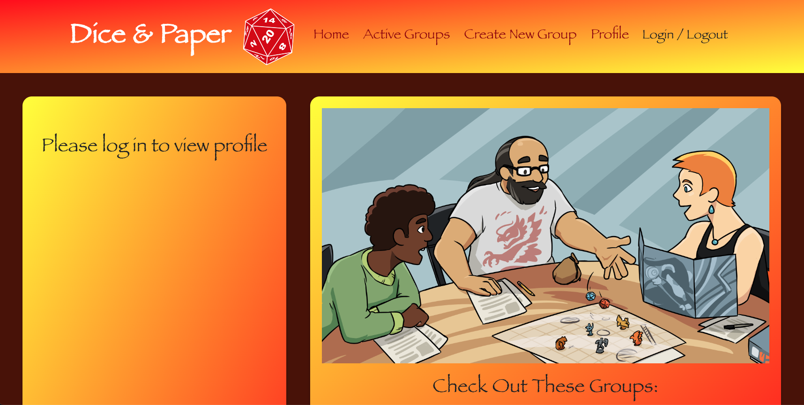

# Dice & Paper - Final Project
  
## Description
  
  * Dice&Paper is a social media site designed to bring together game enthusiasts and allow them to form new groups of people to play with. The application allows you to create your own profile, add yourself to existing gaming groups, and even create your own. The site is geared towards table-top RPGs and card games, but can be utilized to create any number of gaming groups. 
  
  ## Table of Contents
  
  * [Usage](#Usage)
  * [Contributing](#Contributing)
  * [Tests](#Tests)
  * [License](#License)
  * [Questions](#Questions)
  
  ## Usage
  
  * Anyone can access and use this application. The application is live at: 

  * Github repository for source files: https://github.com/TGray95/congenial-spork

  * Link to deployed application: https://dice-n-paper.herokuapp.com/
  
  ## Contributing
  
  * This project was created by Zachary Ellis, Lexie Flock, Tony Gray, Madalyn Marino, Adem Sahil, and Hunter White. Their GitHub information is listed below.
  
  * **GitHub Profiles of the Creators** 
  * Zachary Ellis - **https://github.com/zellis117**,
  * Lexie Flock - **https://github.com/LexieFlock**,
  * Tony Gray - **https://github.com/TGray95**,
  * Madalyn Marino - **https://github.com/madalynmm**,
  * Adem Sahil - **https://github.com/ademsahil274**,
  * Hunter White - **https://github.com/HWhite123**,

  
  ## Tests
  
  * This application has only been tested locally.
  
  ## License
  
  * This application is licensed under the MIT license type.
  
  ## Questions
  * If you have any questions regarding the application, please reach out to any of the application creators: **Zachary Ellis**, **Lexie Flock**, **Tony Gray**, **Madalyn Marino**, **Adem Sahil**, and **Hunter White**.
  
  ## Screenshot of the Application

  
